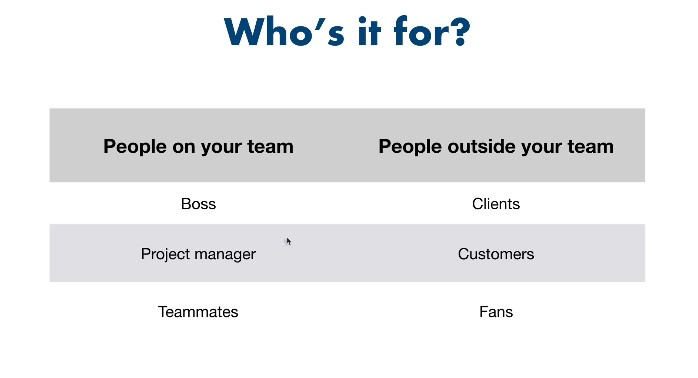
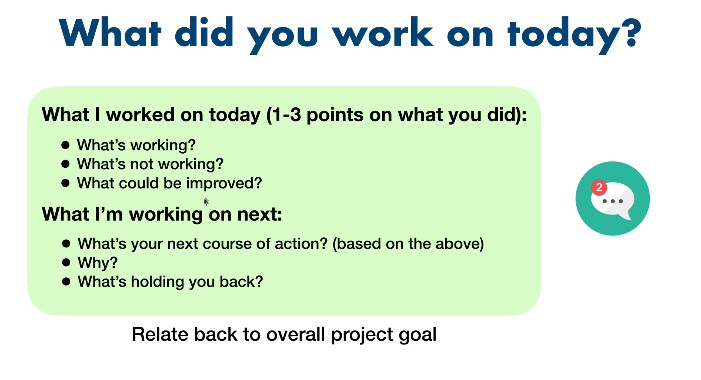
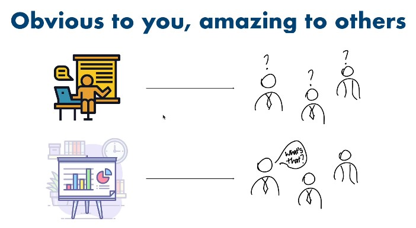

# Communication in Data Science

Communication is a vital and integral part of data science and Machine learning
You need to properly communicate your work if it is to be relevant to the particular audience

## Steps in Properly Communicating your work

1. You need to determine the audience in terms of `is it a member of your team` or `is it a person outside of your team`
2. You need to determine what to tell for each use case

Here is an illustration;

## Communicating with team members

Often, a team member such as your manager will want to know critical aspects such as;
a. Deadlines
b. Blockers
c. Anticipated Timelines

Here is a good template to use for team communication

### Take note of overlaps

If a question is asked more than `twice`, then it probably needs to be documented
Write down as much as necessary, to capture whatever is needed by the team
Determine whatever is communicated with the `team` or peers that needs to be communicated with `top management` or seniors

## Communicating with People Outside your team

For this one, it is important to begin by asking `what do they need to know?`
Remember that the concept you are explaining might be `obvious to you` but `strange to others`
What you think is `important` may not be `necessary` or important to others

Most people have `a lot to offer` but `rarely` do they `volunteer`
Always `ask` if the presentation is clear
Sometimes, you can respond with `am not sure right now, but let me get back to you concerning that`

Here is an illustration

# Storytelling

When communicating with either team, it is important to ask yourself, `what story am I trying to tell?`

