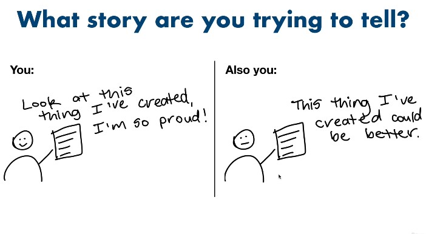

# Communication in Data Science

Communication is a vital and integral part of data science and Machine learning
You need to properly communicate your work if it is to be relevant to the particular audience

## Steps in Properly Communicating your work

1. You need to determine the audience in terms of `is it a member of your team` or `is it a person outside of your team`
2. You need to determine what to tell for each use case

Here is an illustration;

## Communicating with team members

Often, a team member such as your manager will want to know critical aspects such as;
a. Deadlines
b. Blockers
c. Anticipated Timelines

Here is a good template to use for team communication

### Take note of overlaps

If a question is asked more than `twice`, then it probably needs to be documented
Write down as much as necessary, to capture whatever is needed by the team
Determine whatever is communicated with the `team` or peers that needs to be communicated with `top management` or seniors

## Communicating with People Outside your team

For this one, it is important to begin by asking `what do they need to know?`
Remember that the concept you are explaining might be `obvious to you` but `strange to others`
What you think is `important` may not be `necessary` or important to others

Most people have `a lot to offer` but `rarely` do they `volunteer`
Always `ask` if the presentation is clear
Sometimes, you can respond with `am not sure right now, but let me get back to you concerning that`

Here is an illustration

# Storytelling

When communicating with either team, it is important to ask yourself, `what story am I trying to tell?`

When sharing what you have done, it is important to work it into a `story`

How you deliver your message, depends on the audience, and these `two questions`
a. What is it for?
b. What do they want to know?

Ensure you `write it down` to have a good record of what you are doing
`Break it down` to smaller projects which are achievable
Dont go for perfection, go for `project`

Don't worry about being wrong, worry about `learning something new`

# Blogs that Could Help with the Documenting of Personal Work

Here are some blogs that can improve your blogging skills as a data science or ML engineer

[The HashNode Blog](https://hashnode.com/)

[How to Think About Communicating and Sharing Your Technical Work](https://www.mrdbourke.com/how-to-think-about-communicating-and-sharing-your-work/)

[Basecamp’s guide to internal communication](https://basecamp.com/guides/how-we-communicate) – if you're working on a team, this should be required reading for everyone.

[How to Start Your Own Machine Learning Projects by Daniel Bourke](https://www.mrdbourke.com/how-to-start-your-own-machine-learning-projects/) –After learning foundational skills using courses, one of the hardest things to do next is using the skills you've learned in your own projects. This article by yours truly gives a deeper breakdown into how to approach your own projects.

[Why you (yes, you) should blog by Rachel Thomas from fast.ai](https://medium.com/@racheltho/why-you-yes-you-should-blog-7d2544ac1045) – Rachel Thomas not only has incredible technical skills, she's a phenomenal communicator. If you aren't convinced to start your own blog yet, this article will have you writing in no time.

[Fast Template by fast.ai](https://www.fast.ai/posts/2020-01-16-fast_template.html) – Starting a blog should be required for everyone learning some kind of skill. Fast Template by the fast.ai team makes it free and easy.

[Devblog by Hashnode](https://hashnode.com/) – Your own blog, your own domain, readers ready to go, you own your content (automatic backups on GitHub), all ready to go. Start writing.

[Devblog: How to Launch Your Own Developer Blog on Your Own Domain in Minutes](https://www.freecodecamp.org/news/devblog-launch-your-developer-blog-own-domain/) - A great tutorial from Quincy Larson on how to launch your own free blog with Devblog (the resource linked above).
